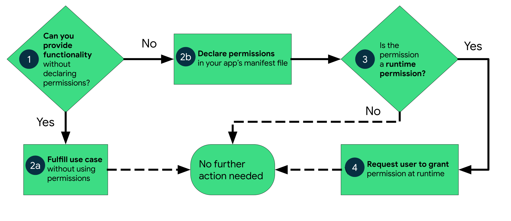

# Assignment 2

## ROM (Android OS)

### ROM là gì?

ROM (Android OS) là hệ điều hành giúp chạy thiết bị và được lưu trong ROM (Read only memory). Ta có Google
Pixel sử dụng stock Android chưa được tuỳ biết. Ngoài ra các nhà sản xuất thường
tuỳ chỉnh ROM riêng cho họ như _MIUI_

Việc tuỳ biến ROM có thể thay đổi 1 số tuỳ tính năng, tối ưu hoá phần mềm.

ROM có 2 partition chính:

- System partition (/system)
- Userdata partition (/userdata)

App theo ROM được cài trong /system.
App được người tải thì sẽ nằm trong /userdata.
Và bản bản cập nhật cho áp hệ thống cũng được cài trong /userdata.

## App và ROM

Mỗi app Android lives in its own security box, được bảo vệ bởi cách tính năng Android sau:

- Android OS là hệ điều hành Linux đa người dùng, với mỗi app là 1 người dùng.
- Mặc định, hệ thống cấp cho mỗi app 1 User ID riêng (chỉ hệ thống biết). Và hệ
  thống set quyền cho tất cả các file trong app và chỉ có ID theo app đó được
  truy cập.
- Mỗi process có VM riêng, nên code của mỗi app chạy tách biết khỏi nhau.
- Mặc định thì mỗi app chạy trong process của riêng nó. Android system chạy process
  khi mà app component cần executed, và tắt khi không cần để thu hồi bộ nhớ.

Mặc dù như thế nhưng:

- Hai app vẫn có thể chia sẻ file cho nhau. nhưng phải có cùng certificate.
- Ta vẫn có thể cấp quyền truy cập cho app.

## Sim card

Trong Android thì Sim card được quản lý bới API _TelephonyManager_.

Với API này thì app có thể xác định được state và service, cũng như là truy cập vào
một số loại thông tin nhất định.

```Java
telephonyManager = defaultSubTelephonyManager.createForSubscriptionID(subId)
```

Cần sử dụng **FEATURE_TELPHONY**

Còn cách lệnh và tham số xem thêm tại [đây](https://developer.android.com/reference/android/telephony/TelephonyManager)

Tìm hiểu UIIC (Universal Integrated Circuit)

## Calling

Có trong framework _android.telecom_

## Tìm hiểu về quyền

Quyền bảo vệ người dụng và bảo vệ quyền truy cập vào

- **Restricted data**, trạng thái của hệ thống và thông tin người dùng.
- **Restricted actions**, ghi, thu và kết nối.

Biểu đồ mô tả về quyền trong Android



Các loại quyền:

- Install-time permission
- Normal permission
- Signature permission
- Runtime permission
- Special permission

## Khi nào chúng ta cần xin quyền

- Cần truy cập địa chỉ
- Truy cập camera hay chụp hình quay phim
- Mở media, các văn bản, ...
- Bluetooth
- Danh bạ
  ....

## Cách thức khai báo quyền

```xml
<manifest ...>
    <uses-permission android:name="android.permission.CAMERA"/>
    <application ...>
        ...
    </application>
</manifest>
```

```xml
<manifest ...>
    <application>
        ...
    </application>
    <uses-feature android:name="android.hardware.camera"
                  android:required="false" />
<manifest>
```

### Logic xin quyền

- Kiểm tra đã được cấp phép quyền hay chưa.
- Nếu đã được cấp phép thì ta tiếp tục còn không thì ta phải xin quyền.

Ví dụ về hàm kiểm tra quyền

```Java
    private boolean hasCameraPermission() {
        return ContextCompat.checkSelfPermission(this,
                Manifest.permission.CAMERA) == PackageManager.PERMISSION_GRANTED;
    }
```

Còn đây là hàm xin quyền

```Java
    private void requestPermission() {
        ActivityCompat.requestPermissions(this,
                new String[] {Manifest.permission.CAMERA},
                MY_CAMERA_REQUEST_CODE);
    }

```

## Cách chỉnh dependencies

Chỉnh **dependencies** trong file **build.gradle** trong mục **dependencies**

Ví dụ ta thêm _dependencies_ của _camerax_.

```java
    def camerax_version = '1.1.0'
    implementation "androidx.camera:camera-core:${camerax_version}"
    implementation "androidx.camera:camera-camera2:${camerax_version}"
    implementation "androidx.camera:camera-lifecycle:${camerax_version}"
    implementation "androidx.camera:camera-view:${camerax_version}"
    implementation "androidx.camera:camera-extensions:${camerax_version}"
```

## Camera

Về Camera thì ta có API _CameraX_, đây là một API trong bộ _Jetpack library_,
đây là một API tốt.
Để sử dụng cameraX thì ta cũng xin cấp quyền camera, kèm với đó là chỉnh
dependencies. Và ta sử _CameraProviders_

## ArrayAdapter

Kết nối source -> list view

```Java
ArrayAdapter<String> itemsAdapter =
    new ArrayAdapter<String>(this, android.R.layout.simple_list_item_1, items);
```

```Java
ListView listView = (ListView) findViewById(R.id.lvItems);
listView.setAdapter(itemsAdapter);
```

## Bluetooth

Tất cả API của Bluetooth nằm trong _android.bluetooth_
API chính là _BluetoothAdapter_

Xem thêm tại [đây](https://developer.android.com/guide/topics/connectivity/bluetooth)

## Wifi

API chính là _WifiManager_

Quyền

```xml
    <uses-permission android:name="android.permission.ACCESS_WIFI_STATE"/>
    <uses-permission android:name="android.permission.CHANGE_WIFI_STATE"/>
```

## Cách ta cài đặt một chương trình bằng lệnh

Trước hết là ta phải xin quyền cài đặt như sau:

```xml
<uses-permission android:name="android.permission.REQUEST_INSTALL_PACKAGES" />
<uses-permission android:name="android.permission.READ_EXTERNAL_STORAGE" />
<uses-permission android:name="android.permission.WRITE_EXTERNAL_STORAGE" />
```

Tạo một _provider_

```xml
<provider
        android:name="androidx.core.content.FileProvider"
        android:authorities="${applicationId}.provider"
        android:exported="false"
        android:grantUriPermissions="true">
        <meta-data
            android:name="android.support.FILE_PROVIDER_PATHS"
            android:resource="@xml/provider_paths" />
    </provider>
```

Tạo ra thư mục để ta có thể lưu app

```xml
<?xml version="1.0" encoding="utf-8"?>
<paths xmlns:android="http://schemas.android.com/apk/res/android">
    <files-path
        name="files_root"
        path="Android/data/${applicationId}" />
    <files-path
        name="external_files"
        path="." />
</paths>
```

**Từ đây ta sẽ có logic để viết 1 app store như sau**

- Ta sẽ tải file xuống từ server.
- Sau đó cài đặt như trên.
- Trong quá trình cài đặt nếu người dùng huỷ hoặc xảy ra sự cố thì ta huỷ và xoá
  file.
- Lưu ý quá trình cài đặt ta nên đặt ở threading

## Thread và Multi Threading trong Android

Tất cả Android app dùng _Main Thread_ để chạy UI operations. Gọi một _long-running
operation_ có thể dẫn tới đứng app hoặc không phản hồi.

Hiện tại thì _Async_ đã bị deprecated và ta sẽ dụng _Executor_ để thay thế.

Syntax của _Executor_ như sau:

```Java
 class SerialExecutor implements Executor {
   final Queue<Runnable> tasks = new ArrayDeque<>();
   final Executor executor;
   Runnable active;

   SerialExecutor(Executor executor) {
     this.executor = executor;
   }

   public synchronized void execute(Runnable r) {
     tasks.add(() -> {
       try {
         r.run();
       } finally {
         scheduleNext();
       }
     });
     if (active == null) {
       scheduleNext();
     }
   }

   protected synchronized void scheduleNext() {
     if ((active = tasks.poll()) != null) {
       executor.execute(active);
     }
   }
 }
```

## Tổng hợp về 2 app

## App camera scan code QR

Ta sẽ dụng API _CameraX_ và _Google MLKit_ để scan code QR.

Trước tiên ta cần phải thêm dependencies như sau

```java
    // Khai bao phiên bản CameraX mà ta sẽ sử dụng
    def camerax_version = '1.1.0'
    implementation "androidx.camera:camera-core:${camerax_version}"
    implementation "androidx.camera:camera-camera2:${camerax_version}"
    implementation "androidx.camera:camera-lifecycle:${camerax_version}"
    implementation "androidx.camera:camera-view:${camerax_version}"
    implementation "androidx.camera:camera-extensions:${camerax_version}"
  // Khai bao google MKKit đề scan QR code
    implementation 'com.google.mlkit:barcode-scanning:17.0.2'
```

Còn đây là hàm chính để ta xử lý hình ảnh

```Java
    private void bindImageAnalysis(@NonNull ProcessCameraProvider cameraProvider) {
        BarcodeScannerOptions options =
                new BarcodeScannerOptions.Builder()
                        .setBarcodeFormats(
                                Barcode.FORMAT_QR_CODE,
                                Barcode.FORMAT_AZTEC)
                        .build();
        BarcodeScanner scanner = BarcodeScanning.getClient(options);
        ImageAnalysis imageAnalysis =
                new ImageAnalysis.Builder().setTargetResolution(new Size(1280, 720))
                        .setBackpressureStrategy(ImageAnalysis.STRATEGY_KEEP_ONLY_LATEST).build();
        imageAnalysis.setAnalyzer(ContextCompat.getMainExecutor(this), new ImageAnalysis.Analyzer() {
            @Override
            public void analyze(@NonNull ImageProxy imageProxy) {
                // Remember this line
                @SuppressLint("UnsafeOptInUsageError") Image mediaImage = imageProxy.getImage();
                if (mediaImage != null) {
                    InputImage image =
                            InputImage.fromMediaImage(mediaImage, imageProxy.getImageInfo().getRotationDegrees());
                    Task<List<Barcode>> result = scanner.process(image)
                            .addOnSuccessListener(barcodes -> {
                                TextView displayResult = findViewById(R.id.resultView);
                                for (Barcode barcode : barcodes) {
                                    displayResult.append(barcode.getRawValue());
                                }
                            })
                            .addOnFailureListener(new OnFailureListener() {
                                @Override
                                public void onFailure(@NonNull Exception e) {
                                }
                            })
                            .addOnCompleteListener(new OnCompleteListener<List<Barcode>>() {
                                @Override
                                public void onComplete(@NonNull Task<List<Barcode>> task) {
                                    imageProxy.close();
                                }
                            });
                }
            }
        });
        Preview preview = new Preview.Builder().build();
        CameraSelector cameraSelector = new CameraSelector.Builder()
                .requireLensFacing(CameraSelector.LENS_FACING_BACK).build();
        preview.setSurfaceProvider(previewView.getSurfaceProvider());
        cameraProvider.bindToLifecycle((LifecycleOwner)this, cameraSelector,
                imageAnalysis, preview);
    }

```

Còn đối với chương trình Store thì như sau:

Ta có 2 hàm chính là _downloadFile_ và _instalAPK_

Lưu ý là download file thì ta phải làm trong thread khác trong được chạy trong main thread

```Java
    private String downloadFile(String f_url) {
        new Thread(new Runnable() {
            @Override
            public void run() {
                try {
                    URL url = new URL(f_url);
                    InputStream in = url.openStream();
                    BufferedInputStream bis = new BufferedInputStream(in);
                    FileOutputStream fos = new FileOutputStream(getFilesDir().toString() + "/app.apk");
                    byte[] data = new byte[1024];
                    int count;
                    while ((count = bis.read(data, 0, 1024)) != -1) {
                        fos.write(data, 0, count);
                    }
                    fos.flush();
                    fos.close();
                    bis.close();
                } catch (Exception e) {
                    e.printStackTrace();
                }
            }
        }).start();
        return null;
    }

```

Còn đây là hàm _installAPK()_

```Java
    private void installAPK(){
        String PATH = getFilesDir().toString() + "/camera_app.apk";
        File file = new File(PATH);
        if(file.exists()) {
            Intent intent = new Intent(Intent.ACTION_VIEW);
            intent.setDataAndType(uriFromFile(getApplicationContext(), new File(PATH)), "application/vnd.android.package-archive");
            intent.addFlags(Intent.FLAG_ACTIVITY_NEW_TASK);
            intent.addFlags(Intent.FLAG_GRANT_READ_URI_PERMISSION);
            try {
                getApplicationContext().startActivity(intent);
            } catch (ActivityNotFoundException e) {
                e.printStackTrace();
                Log.e("TAG", "Error in opening the file!");
            }
        } else {
            Toast.makeText(getApplicationContext(),"installing", Toast.LENGTH_LONG).show();
        }
    }

    Uri uriFromFile(Context context, File file) {
        if (Build.VERSION.SDK_INT >= Build.VERSION_CODES.N) {
            return FileProvider.getUriForFile(context, BuildConfig.APPLICATION_ID + ".provider", file);
        } else {
            return Uri.fromFile(file);
        }
    }

```

[Video test v1](https://youtu.be/kPITkPPNBKA)

[Video test v2](https://youtu.be/xP7eUziB9nc)

Các nâng cấp trong tương lai

- Thêm nhiều app lập adapater list để lựa chọn
- Thêm các progressing bar cho quá trình download và installing.

Các vấn đề cần phải học hỏi thêm

- Về thread và handler để xử lý việc tải xuống nhiều mục cũng như tiếp tục tải khi ẩn chuong trình.
- Về việc save trạng thái của activity.
